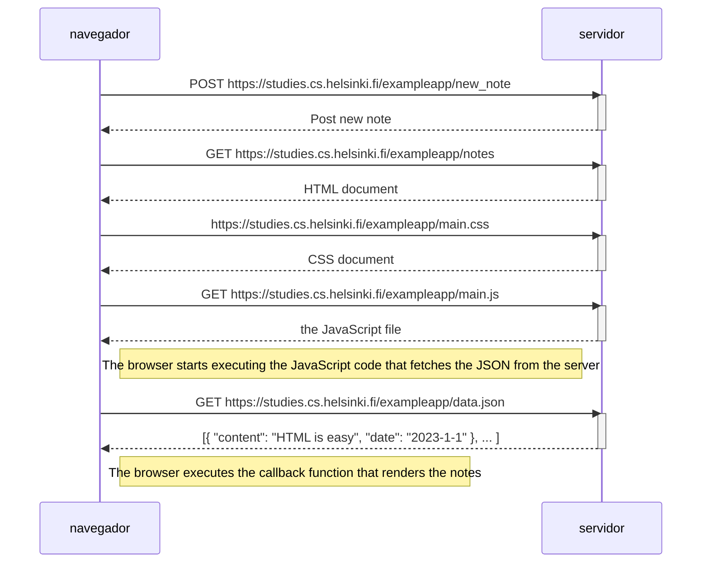

```mermaid
sequenceDiagram
    participant navegador
    participant servidor

    navegador->>servidor: POST https://studies.cs.helsinki.fi/exampleapp/new_note
    activate servidor
    servidor-->>navegador: Post new note
    deactivate servidor

    navegador->>servidor: GET https://studies.cs.helsinki.fi/exampleapp/notes
    activate servidor
    servidor-->>navegador: HTML document
    deactivate servidor

    navegador->>servidor: https://studies.cs.helsinki.fi/exampleapp/main.css
    activate servidor
    servidor-->>navegador: CSS document
    deactivate servidor

    navegador->>servidor: GET https://studies.cs.helsinki.fi/exampleapp/main.js
    activate servidor
    servidor-->>navegador: the JavaScript file
    deactivate servidor

    Note right of navegador: The browser starts executing the JavaScript code that fetches the JSON from the server

    navegador->>servidor: GET https://studies.cs.helsinki.fi/exampleapp/data.json
    activate servidor
    servidor-->>navegador: [{ "content": "HTML is easy", "date": "2023-1-1" }, ... ]
    deactivate servidor

    Note right of navegador: The browser executes the callback function that renders the notes

```
